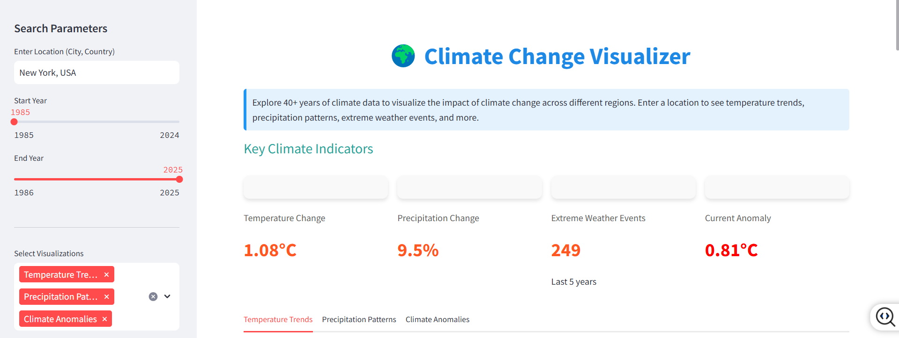

# Climate Change Visualizer

A comprehensive interactive web application built with Streamlit that visualizes climate change data across different regions, allowing users to explore temperature trends, precipitation patterns, extreme weather events, and future projections.

![Climate Change Visualizer]

## Features

- **Location-based Analysis**: Enter any city or region to visualize local climate data
- **40+ Years of Climate Data**: Explore historical climate trends from 1980 to present
- **Multiple Visualization Types**:
  - Temperature Trends
  - Precipitation Patterns
  - Extreme Weather Events
  - Climate Anomalies
  - Sea Level Rise
  - CO2 Emissions
  - Climate Projections
- **Interactive Maps**: Geographical representation of climate impacts
- **Key Climate Indicators**: At-a-glance metrics showing climate change impacts

## Installation

### Prerequisites

- Python 3.7 or higher

### Dependencies

Install the required packages:

```bash
pip install streamlit pandas numpy matplotlib plotly requests geopy folium streamlit-folium
```


## Usage

1. Clone the repository:
```bash
git clone https://github.com/Immanuvel1207/Climate-visualizer.git
cd Climate-visualizer
```

2. Run the Streamlit application:
```bash
streamlit run app.py
```

3. Open your web browser and navigate to http://localhost:8501

## How to Use

1. Enter a location (city, country) in the sidebar
2. Adjust the year range using the sliders
3. Select visualization types you want to explore
4. Interact with the charts by hovering, zooming, and panning

## Data Methodology

- **Climate Data**: Generated using location-specific climate models
- **Temperature Anomalies**: Calculated relative to the 1980-2010 baseline period
- **Extreme Events**: Defined as days exceeding the 95th percentile
- **Projections**: Based on trend models with low, medium, and high emission scenarios

## Project Structure

```
climate-visualizer/
│
├── app.py                  # Main Streamlit application
├── requirements.txt        # Python dependencies
├── README.md               # Project documentation
└── .gitignore              # Git ignore file
```

## Contributing

Contributions are welcome! Please feel free to submit a Pull Request.

1. Fork the repository
2. Create your feature branch (`git checkout -b feature/amazing-feature`)
3. Commit your changes (`git commit -m 'Add some amazing feature'`)
4. Push to the branch (`git push origin feature/amazing-feature`)
5. Open a Pull Request

## License

This project is licensed under the MIT License - see the LICENSE file for details.

## Disclaimer

This visualization tool provides estimates based on climate models. For detailed scientific analysis, please consult specialized climate research institutions.

## Acknowledgements

- [Streamlit](https://streamlit.io/)
- [Plotly](https://plotly.com/)
- [Folium](https://python-visualization.github.io/folium/)